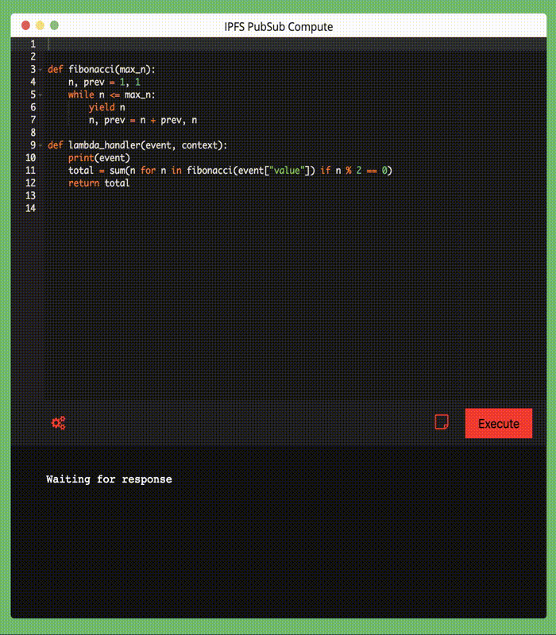

# ipfs-pubsub-compute

## Overview

This is a tiny IPFS PubSub application built in Golang and is less than 130 lines of code. It allows you to write `Python 3.7` code in the browser send the code and the input to IPFS pubsub, which another listening device in the channel then picks up and executes using AWS's Lambda Docker container.



## Setup

Please install the dependencies
```
docker - version 18.09.1
go     - go1.11.5 
ipfs   - version 0.4.18
```

Also you'll need to fetch the AWS Lambda Docker at, https://github.com/lambci/docker-lambda

To get the image just run:
```

docker pull lambci/lambda:python3.7 

```

## Running

Now you should be 

```
git clone https://github.com/drbh/ipfs-pubsub-compute.git
cd ipfs-pubsub-compute
```

Running precompiled binary (on OSX)
```
./ipfs-pubsub-compute 
```

Run `go` source files files, you'll need to `go get` a few libraries
```
go run execute.go server.go 
```
